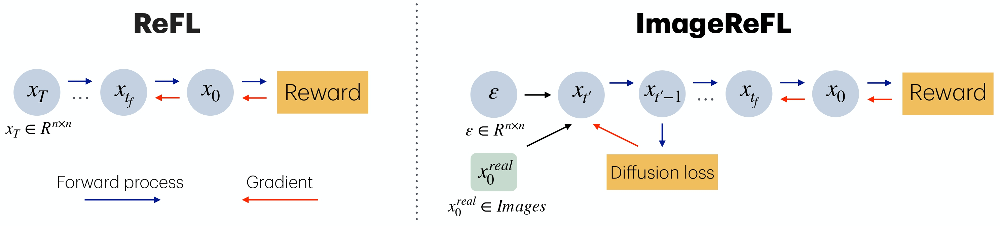
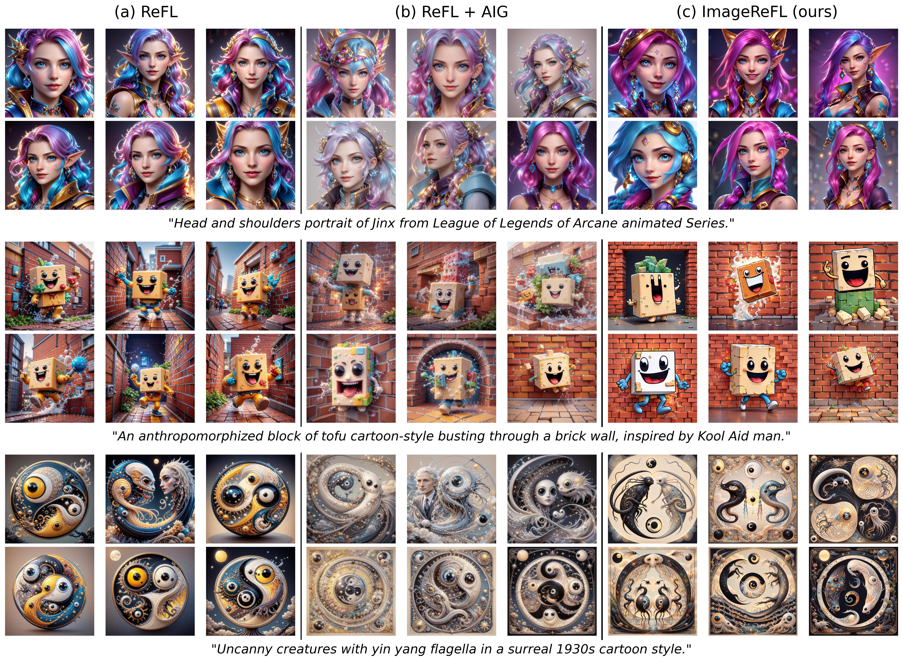

# ImageReFL: Balancing Quality and Diversity in Human-Aligned Diffusion Models

<a href="https://arxiv.org/abs/2505.22569"></a>
<a href="https://huggingface.co/collections/ControlGenAI/imagerefl-683ed170b6af68d53af50b99">
  
</a>
<a href="https://colab.research.google.com/drive/16AqdG4bIzE6ND4Us-1a12stlcPgxxF7m?usp=sharing">
  
</a>
[](./LICENSE)


> Recent advances in diffusion models have led to impressive image generation capabilities, but aligning these models with human preferences remains challenging. Reward-based fine-tuning using models trained on human feedback improves alignment but often harms diversity, producing less varied outputs. In this work, we address this trade-off with two contributions. First, we introduce \textit{combined generation}, a novel sampling strategy that applies a reward-tuned diffusion model only in the later stages of the generation process, while preserving the base model for earlier steps. This approach mitigates early-stage overfitting and helps retain global structure and diversity. Second, we propose \textit{ImageReFL}, a fine-tuning method that improves image diversity with minimal loss in quality by training on real images and incorporating multiple regularizers, including diffusion and ReFL losses. Our approach outperforms conventional reward tuning methods on standard quality and diversity metrics. A user study further confirms that our method better balances human preference alignment and visual diversity.

<p align="center">
  
  <br>
Comparison of ImageReFL with the standard approach.
Unlike classical ReFL, ImageReFL incorporates real images to train the model to make significant changes during the final diffusion steps.
</p>

<p align="center">
  
  <br>
Comparison of ImageReFL with ReFL and ReFL AIG baselines using SDXL trained on
HPSv2.1.
</p>

## Updates

- [29/05/2025] 🔥🔥🔥 ImageReFL release. Paper has been published on [Arxiv](https://arxiv.org/abs/2505.22569).

## Prerequisites
You need following hardware and python version to run our method.
- Linux
- NVIDIA GPU + CUDA CuDNN
- Conda 25.1.1+ or Python 3.12+

## Installation

* Clone this repo:
```bash
git clone https://github.com/ControlGenAI/ImageReFL.git
cd ImageReFL
```

* Create Conda environment:
```bash
conda create -n image_refl python=3.11
conda activate image_refl
```

* Install the dependencies in your environment:
```bash
pip install -r requirements.txt
```


## Reward model installation
Some image reward models require additional steps for installation:

* **MPS**:
You need to download the model weights by following the instructions in the original repository: [https://github.com/Kwai-Kolors/MPS](https://github.com/Kwai-Kolors/MPS).
After downloading, specify the path to the model weights in the corresponding reward model configuration file located at `src/reward_models/<config_name>`.
* **ImageReward**
Unfortunately, ImageReward does not support installation via `pip`. You need to install it manually:
```bash
# Clone the ImageReward repository (containing data for testing)
git clone https://github.com/THUDM/ImageReward.git
cd ImageReward

# Install the integrated package `image-reward`
pip install image-reward
# Return to work dir.
cd ..
```

## Training pipeline
To run the ImageReFL fine-tuning algorithm with default parameters:
```bash
HYDRA_FULL_ERROR=1 python train.py --config-name image_refl_train
```

You can also customize parameters using Hydra syntax. For example:
```bash
HYDRA_FULL_ERROR=1 python train.py writer.run_name='wandb_run_name' --config-name image_refl_train
```

To run the standard ReFL algorithm:

```bash
HYDRA_FULL_ERROR=1 python train.py --config-name refl_train
```

The original experiments were conducted on an NVIDIA A100 80GB GPU.
You may need to adjust the training hyperparameters to suit your hardware setup.

### Evaluate the final model

To run inference with a trained model and compute image quality metrics, use:

```bash
HYDRA_FULL_ERROR=1 python inference.py inferencer.from_pretrained="saved/<your_train_run_name>/checkpoint-epoch20.pth"
```

### Image Inference

You can also use our pre-trained model from Hugging Face for image generation. Example usage:

```
from diffusers import DiffusionPipeline

pipe = DiffusionPipeline.from_pretrained(
    "ControlGenAI/ImageReFL_HPS_SD",
    trust_remote_code=True
).to(device)

prompt = "Astronaut in a jungle, cold color palette, muted colors, detailed, 8k"
image = pipe(prompt).images[0]
```

## References & Acknowledgments

The repository has used several codebases:
* [Template for DL projects](https://github.com/Blinorot/pytorch_project_template)
* [ReFL implementation](https://github.com/THUDM/ImageReward)
* [Implementation of DreamBooth, Textual Inversion and LoRA fine-tuning methods from diffusers](https://github.com/huggingface/diffusers)

## Citation

If you use this code or our findings for your research, please cite our paper:
```
@misc{sorokin2025imagereflbalancingqualitydiversity,
      title={ImageReFL: Balancing Quality and Diversity in Human-Aligned Diffusion Models},
      author={Dmitrii Sorokin and Maksim Nakhodnov and Andrey Kuznetsov and Aibek Alanov},
      year={2025},
      eprint={2505.22569},
      archivePrefix={arXiv},
      primaryClass={cs.CV},
      url={https://arxiv.org/abs/2505.22569},
}
```
